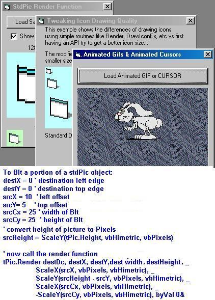



## FYI: StdPicture\.Render Function

### Description

It appears this VB function can easily replace APIs like BitBlt, StretchBlt, DrawIconEx and others. So how do you use this function that no one seems to use? Included are a few ideas and "how to's". Hoping others more knowledgeable will add positive comments so others can learn too. Zip updated to include sample of portion Rendering. No BitBlt API used at all in examples.
 
### More Info
 

             |
---                |---
**Submitted On**   |2005-01-04 21:18:44
**By**             |[LaVolpe](https://github.com/Planet-Source-Code/PSCIndex/blob/master/ByAuthor/lavolpe.md)
**Level**          |Intermediate
**User Rating**    |4.8 (86 globes from 18 users)
**Compatibility**  |VB 6\.0
**Category**       |[Graphics](https://github.com/Planet-Source-Code/PSCIndex/blob/master/ByCategory/graphics__1-46.md)
**World**          |[Visual Basic](https://github.com/Planet-Source-Code/PSCIndex/blob/master/ByWorld/visual-basic.md)
**Archive File**   |[FYI\_\_StdPi183677142005\.zip](https://github.com/Planet-Source-Code/lavolpe-fyi-stdpicture-render-function__1-58041/archive/master.zip)

